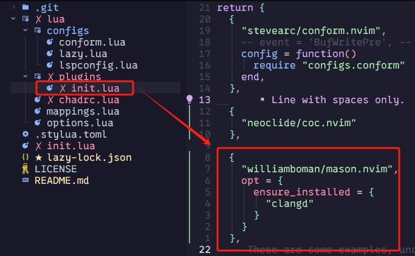
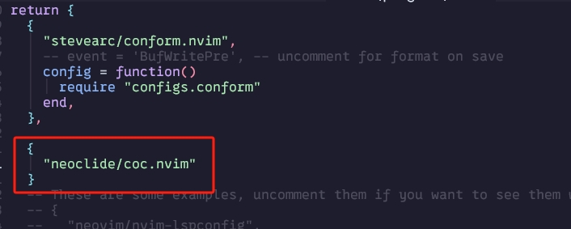

# My NeoVim Setup
## install neo vim:

https://github.com/neovim/neovim/blob/master/INSTALL.md

I recommend to use Winget or Chocolatey.

## Instal NvChad
NvChad is a plugin bundle and manager.

https://nvchad.com/docs/quickstart/install/

I recommend to use 
git clone https://github.com/NvChad/starter
to the ~AppData/Local/nvim
but afterwards, move the root content of starter in to nvim:


afterwards, open terimnal, and type in:
```
nvim
```
this should fire up nvim, and automatically start runing the setup defined in NvChad repo, It uses Lazy.vim as it's plugins management, lazy.nvim will be running all bundled plugins, here is more about lazy vim:

https://github.com/folke/lazy.nvim

when Lazy..vim fished it's job, in nvim command, type in:
```
:MasonInstallAll
```
This uses Mason to install required packages. Mason is another package manger NvChad shipped with, you can look at it's detail here:

https://github.com/williamboman/mason.nvim

you can use it to install additonal packages like language servers, which are needed for real time error check.

To check what it has installed, use vim command:
```
:Mason
```

To install a new package, use:
```
MasonInstall <packagename>
```

## NvChad Icon
to make icons apear properly, a nerd font is needed, you can download them here:
https://www.nerdfonts.com/font-downloads

Right click on the downloaded font, and select install.

After installing, the font of the terminal has to be changed to one of the nerd font, you can do it by open the terminal, and press key combination
```
Ctrl + Shift + ,
``` 
this should open the settings.json, add the font setting as shown in the image: (if you don't know the name of the font, you can view it in word)


NvChad uses Lua to configure it self, know more about what to do with NvChad and Lua here:

https://nvchad.com/docs/quickstart/post-install

## NvChad Auto Completetion

neovim with nvchad uses nvim-treesitter to add auto completion.

to check what is avalaible for auto completion, in vim commands, type in:
```
:TSInstallInfo
```
and to install any auto completion support, type in:
```
TSInstall <language>
```
for example, to install C++:
```
TSInstall cpp
```
## Debugging C++

to be able to debug and give correct hit for a language, a language server is needed. we can install one of these for c++, clangd, we can do that with in nvim command:
```
:MasonInstall clangd
```
this should also be achieve by adding this to ~/AppData/Local/nvim/plugins/init.lua



after adding clangd, we need to add coc.vim wich is Conquer of Completion, it is a host of language servers.
open terminal and go to: 
```
 cd ~/AppData/Local/nvim/lua/plugins/
```
and open init.lua:
```
nvim init.lua
```
here is where we put plugins, to add coc, add another entry as shown in the image

this adds https://github.com/neoclide/coc.nvim as one of the plugins.

save the file, restart nvim, and lazy.vim should install it for you.

finally, to start using clangd with coc.vim, open
```
~AppData/Local/nvim/init.lua
```
and add the following lua code to the back:
```
require('lspconfig').clangd.setup{}
```
test with a c++ file, and the auto completion and error checking should work.