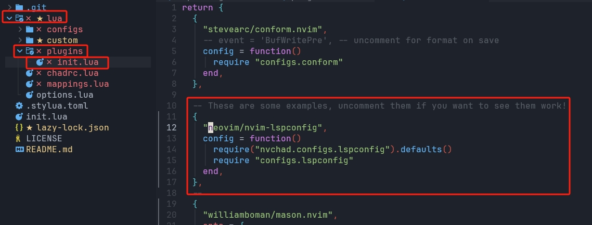
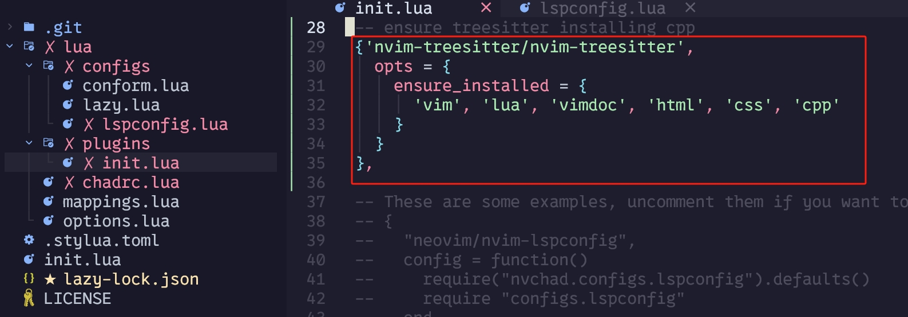
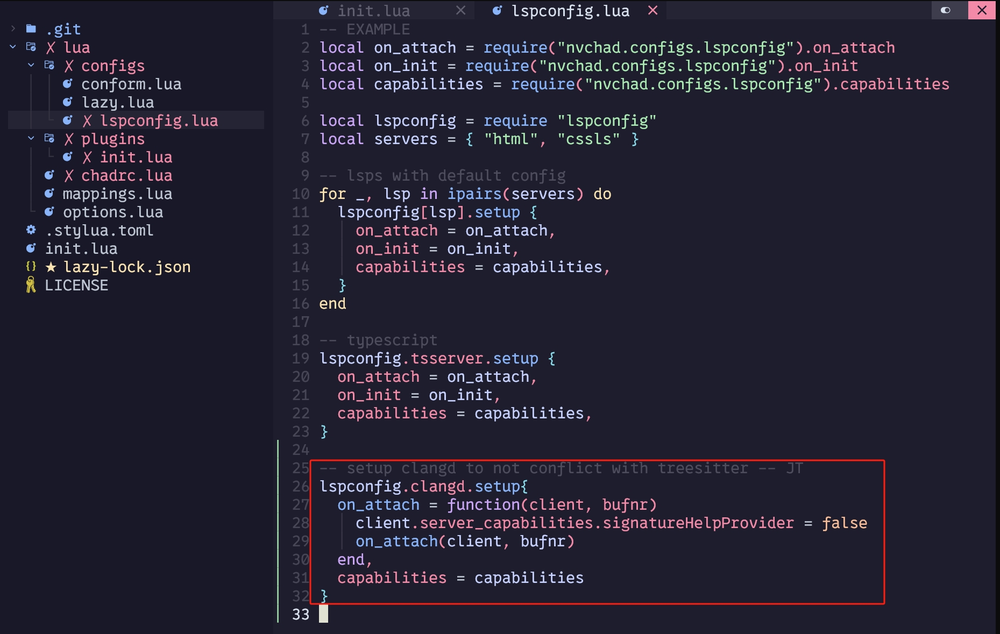

# My NeoVim Setup

## Clean up
if Neovis is already installed, do this to clean up:
```
cd ~/AppData/Local/ 
```
```
rm nvim -Force
```
``` 
rm nvim-data -Force 
```
## Install neo vim:

https://github.com/neovim/neovim/blob/master/INSTALL.md

I recommend to use Winget or Chocolatey.


## Instal NvChad
NvChad is a plugin bundle and manager.

https://nvchad.com/docs/quickstart/install/

I recommend to use 
git clone https://github.com/NvChad/starter
to the ~/AppData/Local/nvim folder by doing the following:
* navigate to the AppData/Local Folder
``` 
cd ~/AppData/Local
```
* clone NVChad to the nvim foder (the folder nvim look for configurations) 
```
git clone https://github.com/NvChad/starter nvim
```

This is how it should look like:


afterwards, open terimnal, and type in:
```
nvim
```
this should fire up nvim, and automatically start runing the setup defined in NvChad repo, It uses Lazy.vim as it's plugins management, lazy.nvim will be running all bundled plugins, here is more about lazy vim:

https://github.com/folke/lazy.nvim

when Lazy..vim fished it's job, in nvim command, type in:
```
:MasonInstallAll
```
This uses Mason to install required packages. Mason is another package manger NvChad shipped with, you can look at it's detail here:

https://github.com/williamboman/mason.nvim

you can use it to install additonal packages like language servers, which are needed for real time error check.

To check what it has installed, use vim command:
```
:Mason
```

To install a new package, use:
```
MasonInstall <packagename>
```

## NvChad Icon
to make icons apear properly, a nerd font is needed, you can download them here:
https://www.nerdfonts.com/font-downloads

Right click on the downloaded font, and select install.

After installing, the font of the terminal has to be changed to one of the nerd font, you can do it by open the terminal, and press key combination
```
Ctrl + Shift + ,
``` 
this should open the settings.json, add the font setting as shown in the image: (if you don't know the name of the font, you can view it in word)


NvChad uses Lua to configure it self, know more about what to do with NvChad and Lua here:

https://nvchad.com/docs/quickstart/post-install

## Auto Completion C++

to be able to debug and give correct hint for a language, a language server is needed. we can install one of these for c++, clangd, we can do that with in nvim command:
```
:MasonInstall clangd
```
this should also be achieve by adding this to ~/AppData/Local/nvim/plugins/init.lua


You will also need to enable the lsp by uncommenting this:



## Better Parsering Syntax Highlighting 

neovim with nvchad shipped with nvim-treesitter to do Parser and syntax highlighting.

to check what is avaliable, in vim commands, type in:
```
:TSInstallInfo
```
and to install any, type in:
```
TSInstall <language>
```
for example, to install C++:
```
TSInstall cpp
```
this should also be achieved by adding this to ~/AppData/Local/nvim/plugins/init.lua:

unfortunately, tree sitter conflicts with clangd's autocompletion signature help provider, so we can toggle it off in ~AppData/Local/nvim/configs/lspconfig.lua:



# Debugging
* Debugging is still not working yet, need to look into DAP, LLDB, DAP-UI, and how the work
