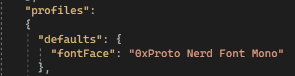

# My NeoVim Setup
## install neo vim:

https://github.com/neovim/neovim/blob/master/INSTALL.md

I recommend to use Winget or Chocolatey.

## Instal NvChad
NvChad is a plugin bundle and manager.

https://nvchad.com/docs/quickstart/install/

I recommend to use 
git clone https://github.com/NvChad/starter
to the ~AppData/Local/nvim
but afterwards, move the root content of starter in to nvim:


afterwards, open terimnal, and type in:
```
nvim
```
this should fire up nvim, and automatically start runing the setup defined in NvChad repo, lazy.nvim will be running all bundled plugins, when that is over, in nvim command, type in:
```
:MasonInstallAll
```
## NvChad Icon
to make icons apear properly, a nerd font is needed, you can download them here:
https://www.nerdfonts.com/font-downloads

Right click on the downloaded font, and select install.

After installing, the font of the terminal has to be changed to one of the nerd font, you can do it by open the terminal, and press key combination
```
Ctrl + Shift + ,
``` 
this should open the settings.json, add the font setting as shown in the image: (if you don't know the name of the font, you can view it in word)





## NvChad Auto Completetion

neovim with nvchad uses nvim-treesitter to add auto completion.

to check what is avalaible for auto completion, in vim commands, type in:
```
:TSInstallInfo
```
and to install any auto completion support, type in:
```
TSInstall <language>
```
for example, to install C++:
```
TSInstall cpp
```


