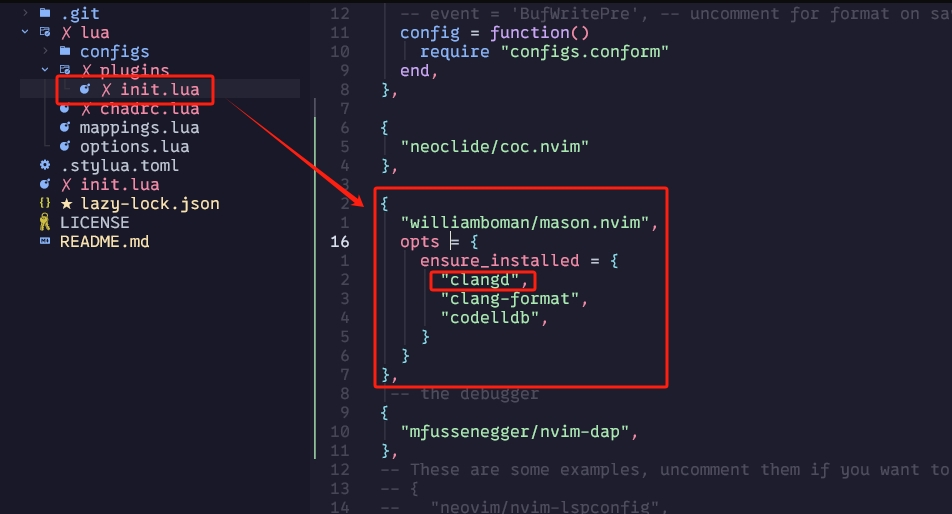

# My NeoVim Setup

## Clean up
if Neovis is already installed, do this to clean up:
```
cd ~/AppData/Local/ 
```
```
rm nvim -Force
```
``` 
rm nvim-data -Force 
```
## Install neo vim:

https://github.com/neovim/neovim/blob/master/INSTALL.md

I recommend to use Winget or Chocolatey.


## Instal NvChad
NvChad is a plugin bundle and manager.

https://nvchad.com/docs/quickstart/install/

I recommend to use 
git clone https://github.com/NvChad/starter
to the ~/AppData/Local/nvim folder by doing the following:
* navigate to the AppData/Local Folder
``` 
cd ~/AppData/Local
```
* clone NVChad to the nvim foder (the folder nvim look for configurations) 
```
git clone https://github.com/NvChad/starter nvim
```

This is how it should look like:


afterwards, open terimnal, and type in:
```
nvim
```
this should fire up nvim, and automatically start runing the setup defined in NvChad repo, It uses Lazy.vim as it's plugins management, lazy.nvim will be running all bundled plugins, here is more about lazy vim:

https://github.com/folke/lazy.nvim

when Lazy.vim fished it's job, in nvim command, type in:
```
:MasonInstallAll
```
This uses Mason to install required packages. Mason is another package manger NvChad shipped with, you can look at it's detail here:

https://github.com/williamboman/mason.nvim

you can use it to install additonal packages like language servers, which are needed for real time error check.

To check what it has installed, use vim command:
```
:Mason
```

To install a new package, use:
```
MasonInstall <packagename>
```

## NvChad Icon
to make icons apear properly, a nerd font is needed, you can download them here:
https://www.nerdfonts.com/font-downloads

Right click on the downloaded font, and select install.

After installing, the font of the terminal has to be changed to one of the nerd font, you can do it by open the terminal, and press key combination
```
Ctrl + Shift + ,
``` 
this should open the settings.json, add the font setting as shown in the image: (if you don't know the name of the font, you can view it in word)


NvChad uses Lua to configure it self, know more about what to do with NvChad and Lua here:

https://nvchad.com/docs/quickstart/post-install

## Auto Completion C++

to be able to debug and give correct hint for a language, a language server is needed. we can install one of these for c++, clangd, we can do that with in nvim command:
```
:MasonInstall clangd
```
this should also be achieve by adding this to ```~/AppData/Local/nvim/plugins/init.lua```



You will also need to enable the lsp by uncommenting this:


## Better Parsering Syntax Highlighting 

neovim with nvchad shipped with nvim-treesitter to do Parser and syntax highlighting.

to check what is avaliable, in vim commands, type in:
```
:TSInstallInfo
```
and to install any, type in:
```
TSInstall <language>
```
for example, to install C++:
```
TSInstall cpp
```
this should also be achieved by adding this to ```~/AppData/Local/nvim/plugins/init.lua```:

unfortunately, tree sitter conflicts with clangd's autocompletion signature help provider, so we can toggle it off in ~AppData/Local/nvim/configs/lspconfig.lua:


At the point, the ```~/AppData/Local/nvim/lua/plugins/init.lua``` should look like this:
```lua
return {
  {
    "stevearc/conform.nvim",
    -- event = 'BufWritePre', -- uncomment for format on save
    config = function()
      require "configs.conform"
    end,
  },

  -- These are some examples, uncomment them if you want to see them work!
  {
    "neovim/nvim-lspconfig",
    config = function()
      require("nvchad.configs.lspconfig").defaults()
      require "configs.lspconfig"
    end,
  },
  --
  {
  	"williamboman/mason.nvim",
  	opts = {
  		ensure_installed = {
  			"lua-language-server", "stylua",
  			"html-lsp", "css-lsp" , "prettier", "clangd", "codelldb"
  		},
  	},
  },
  --
  {
  	"nvim-treesitter/nvim-treesitter",
  	opts = {
  		ensure_installed = {
  			"vim", "lua", "vimdoc",
       "html", "css", "cpp"
  		},
  	},
  },
}
```
and the ```~/AppData/Local/nvim/lua/config/lspconfig.lua``` should look like this:
```lua
-- EXAMPLE 
local on_attach = require("nvchad.configs.lspconfig").on_attach
local on_init = require("nvchad.configs.lspconfig").on_init
local capabilities = require("nvchad.configs.lspconfig").capabilities

local lspconfig = require "lspconfig"
local servers = { "html", "cssls" }

-- lsps with default config
for _, lsp in ipairs(servers) do
  lspconfig[lsp].setup {
    on_attach = on_attach,
    on_init = on_init,
    capabilities = capabilities,
  }
end

-- typescript
lspconfig.tsserver.setup {
  on_attach = on_attach,
  on_init = on_init,
  capabilities = capabilities,
}


-- clangd -- needed to make it work ok with treesitter
lspconfig.clangd.setup{
  on_attach = function(client, bufnr)
    client.server_capabilities.signatureHelpPrivider = false
    on_attach(client, bufnr)
  end,

  capabilities = capabilities
}
```
## CMake Project Mutiple File Auto Completion:
To make a cmake project auto completion work, you will need to build it with Ninja to generate a compile-command.json file, lsp needs it to find includes. in your ```CMakeLists.txt``` add this line:
```cmake
set(CMAKE_EXPORT_COMPILE_COMMANDS         ON)
```
it should be placed after:
```cmake
set(CMAKE_CXX_STANDARD                    17)
set(CMAKE_CXX_STANDARD_REQUIRED           ON)
set(CMAKE_CXX_EXTENSIONS                 OFF)
#put in here:
set(CMAKE_EXPORT_COMPILE_COMMANDS         ON)
```
Only Ninja can create the compile-command.json file, not the visual studio generator, to download the Ninja build system(Generator): https://github.com/ninja-build/ninja/releases

unzip it to ```C:/Ninja```:


(This image shows the build-from-source Ninja, so it has addtional files, yours should have just ```ninja.exe``` in ```C:/Ninja/```)
Add add ```C:/Ninja``` to the system path. one way to do it in the powershell is:
```
$path = [Environment]::GetEnvironmentVariable("PATH", "User")
```
add the new path:
```
$newPath = "$path;C:\Ninja"
```

and then:

```
[Environment]::SetEnvironmentVariable("PATH", $newPath, "User")
```

When configuring the cmake file, make sure to use the ```x64 Native Tools Command Prompt for VS 2022``` as the command prompt, it will provide environment varibles, paths to find cl(the visual studio compiler we will use) and it's dependencies. search for it in the start menu, and launch it:


In the opened command prompt, navigate to the project directory, then use the following to tell cmake to use the cl compiler, which is the one visual studio uses, and the generator is Ninja

```cmake -S . -B build -DCMAKE_C_COMPILER=cl -DCMAKE_CXX_COMPILER=cl -G Ninja```

This will create a ```compile_commands.json``` file in the build folder, to make clangd use it, create a ```.clangd``` file in the root directory of the project, and add in the following line:
```
CompileFlags:
  CompilationDatabase: "build"
```
This tells clangd, which is our LSP, to use the ```compile_commands.json``` file in the build folder to find includes and other auto completion infomation.

# Debugging
* Debugging is still not working yet, need to look into DAP, LLDB, DAP-UI, and how they work.
