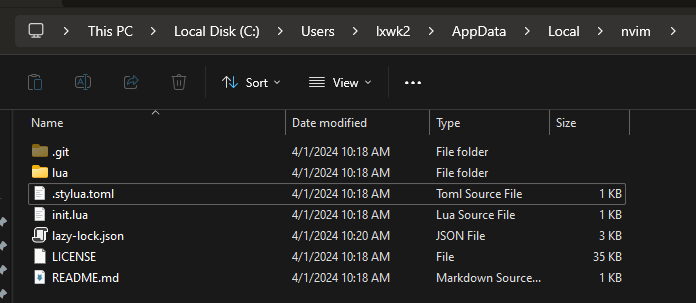

# My NeoVim Setup
## install neo vim:

https://github.com/neovim/neovim/blob/master/INSTALL.md

I recommend to use Winget or Chocolatey.

## Instal NvChad
NvChad is a plugin boundle and manager.

https://nvchad.com/docs/quickstart/install/

I recommend to use 
git clone https://github.com/NvChad/starter
to the ~AppData/Local/nvim
but afterwards, move the root content of starter in to nvim:


afterwards, open terimnal, and type in:
```
nvim
```
this should fire up nvim, and automatically start runing the setup defined in NvChad repo, lazy.nvim will be running all bundled plugins, when that is over, in nvim command, type in:
```
:MasonInstallAll
```

## NvChad Auto Completetion


